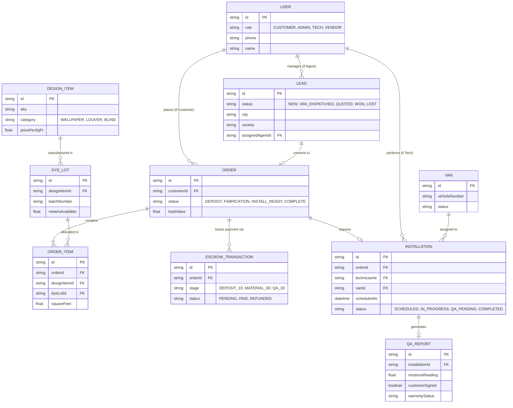

# AuroMakeover — Database Architecture

This document outlines the Entity-Relationship Diagram (ERD) for the expanded AuroMakeover SaaS Platform.

## Full Platform ERD

## Key Architectural Decisions

1. **Escrow Data Model (`ESCROW_TRANSACTION`)**: Instead of a single payment record, payments are strictly divided into three tranches (10% Deposit, 60% Material, 30% QA). This enforces the AuroMakeover brand promise at the database level.
2. **Dye Lot Tracking (`DYE_LOT`)**: Wallpapers require exact batch matching to prevent color variations. The schema ensures that an `ORDER_ITEM` is bound to a specific `DYE_LOT`, not just a generic `DESIGN_ITEM`.
3. **QA Immutability (`QA_REPORT`)**: Installations cannot be marked complete without a corresponding `QA_REPORT` containing moisture readings and sign-offs. This directly triggers the 30% escrow release.
