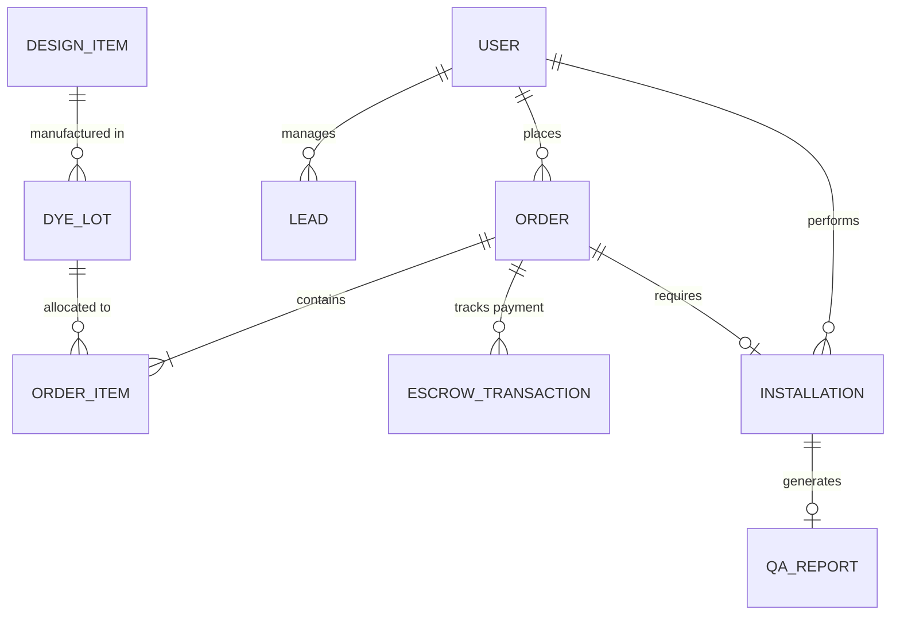

# AuroMakeover — Platform Documentation (Notion Master Export)

> **Instructions for Import:** This document is formatted to cleanly import into Notion. Download this `.md` file, drag it into your Notion workspace, and it will automatically generate the nested headings, tables, code blocks, and toggle lists.

---

# 1. Executive Summary

AuroMakeover is transitioning from a localized interior design service into a **Vertical SaaS Platform** for the 48-hour home makeover industry.

**Core Offerings:**
- Luxury Wallpapers, Fluted Acoustic Louvers, Smart Motorized Blinds
- Zero Civil Work. Zero Dust.
- 48-Hour Installation Guarantee
- 10/60/30 Escrow Payment Protection
- 2-Year Comprehensive Warranty

---

# 2. Phase 1-7 Expansion Roadmap

Phase 1: Customer-Facing Website

- `/about` — Company Story & Team
- `/services` — Full Service Catalog
- `/projects` — Portfolio / Case Studies
- `/pricing` — Transparent Pricing Page
- `/warranty` — 2-Year Warranty Hub
- `/blog` — Content Marketing & SEO Engine

Phase 2: Customer Portal (`/my`)

- `/my/dashboard` — Project tracking (Deposit → Material → Install → QA → Done)
- `/my/payments` — Escrow invoice management
- `/my/support` — Warranty claims and support tickets

Phase 3: Operations Dashboard (`/ops`)

- `/ops/leads` — Lead CRM with Kanban view
- `/ops/inventory` — Warehouse & Inventory Management (Dye-lot tracking)
- `/ops/fleet` — Swatch Van dispatching
- `/ops/finance` — Revenue and Escrow pipelines

Phase 4: Technician Mobile App (`/tech`)

- `/tech/today` — Installation schedule
- `/tech/job/[id]` — Moisture checks, QA photos, Escrow unlock triggers

Phase 5-7: Enterprise SaaS Architecture

- Vendor Portal (`/vendor`) for print orders
- Multi-tenancy for franchising/licensing
- API infrastructure

---

# 3. Animation & UI Design System

The platform will utilize an Apple-grade cinematic animation layer.

## Typography & Color
- **Headings:** Syne (Black/Bold)
- **Body:** Plus Jakarta Sans
- **Colors:** Dark Espresso (`#1C130B`), Warm Gold (`#C5A880`), Terracotta (`#8A5836`)

## Core Animations (GSAP)
1. **Hyperframe Sequences:** Scroll-bound `<canvas>` animations for high-performance 3D/video scrubbing (e.g., watching a room transform dynamically as you scroll down the homepage).
2. **Animated SVG Icons:** Lucide icons replaced with custom GSAP `drawSVG` stroke animations triggered on scroll and hover.
3. **Escrow Visualizers:** Interactive progress bars that fill sequentially to demonstrate the 10/60/30 payment protection.

---

# 4. System UML & Architecture

## ERD (Database Model)

## Actor Use Cases

### Customer
- **Public:** Take AI Quiz, Get Estimate, Browse Portfolio
- **Portal:** Track Order, Pay 10/60/30 Escrow, Claim 2-Year Warranty

### Operations Admin
- **Sales:** Manage Leads, Generate Quotes, Assign Agents
- **Fulfillment:** Dispatch Vans, Manage Dye-Lot Inventory, Generate Vendor POs

### Technician
- **On-site:** View Schedule, Scan Dye-Lot QR, Record Wall Moisture, Upload QA Photos, Trigger 30% Escrow Unlock

---

# 5. Technology Stack
- **Framework:** Next.js 16 (App Router)
- **Styling:** Tailwind CSS v4
- **Animations:** GSAP 3 (ScrollTrigger) + Framer Motion
- **Database:** Prisma ORM (PostgreSQL)
- **Payments (Proposed):** Razorpay Escrow API
- **Auth (Proposed):** NextAuth.js / Clerk

---

# 6. Customer Management Platform (CMP) & Event-Driven Architecture

The core CRM and back-office platform is defined by Phase P0 to P2 extensions, powering AuroMakeover's operations.

## Customer 360 & Core Models
- **Customer Model**: Real-time snapshot of the customer, tracking lifetime value (LTV), NPS, project count, tags, and lifecycle stage.
- **CustomerTimeline**: Immutable event sourcing logging all interactions (calls, WhatsApp messages, payments, site visits) for perfect traceability.
- **CustomerScore**: Live computation of engagement, intent, and value to rank leads.

## 20-State Lifecycle State Machine
A deterministic state machine (`src/lib/services/LifecycleStateMachine.ts`) enforces valid transitions with hard guard conditions.

Key Transitions & Guards

- `ANONYMOUS` → `LEAD_CAPTURED`: Triggered by `quiz_submit` (requires sessionId).
- `QUOTE_SENT` → `DEAL_WON`: Triggered by 10% Escrow Deposit confirmation.
- `MATERIAL_ORDERED` → `INSTALL_SCHEDULED`: Requires both a technician and valid date.
- `INSTALLING` → `QA_PENDING`: Requires technician to upload at least one QA photo.
- `QA_PENDING` → `COMPLETED`: Requires digital customer signature.

## Lead Scoring Engine & SLA Tiers
A three-dimensional scoring system (`src/lib/services/LeadScoringEngine.ts`) runs on each customer update.

| Tier | Score Range | Description & Urgency SLA |
|---|---|---|
| **Tier S** | 80 - 100 | Immediate assignment to senior agent + instant WhatsApp alert. High intent, high value. |
| **Tier A** | 60 - 79 | Assign to available agent within 15 min + auto-send Swatch PDF via WhatsApp. |
| **Tier B** | 40 - 59 | Enrolled in 7-day automated drip WhatsApp campaign to nurture intent. |
| **Tier C** | 0 - 39 | Weekly batch email newsletter (low engagement/intent). |

## Communication Orchestrator & WhatsApp (AiSensy)
All outbound messaging (WhatsApp, SMS, Email) flows through the `CommunicationOrchestrator` (`src/lib/services/CommunicationOrchestrator.ts`).

- **AiSensy Integration**: The system directly connects to WhatsApp Business API via AiSensy.
- **Event-Driven**: The system relies on a central `EventBus`. When the `LifecycleStateMachine` successfully transitions a lead to `QUOTE_SENT`, an event is emitted and the orchestrator dispatches a templated WhatsApp message automatically.
- **Templates**: Dynamic handlebars-style string replacement stored natively in Prisma.

## Live Inventory Tracking & Supply Chain
Materials and field dispatches are tracked precisely.

- **Dye-Lot Tracking**: Wallpaper batches are logged by `DyeLot` (CMYK code and substrate batch) to eliminate slight color discrepancies across walls.
- **Serial Depletion**: Rolls are serialized. When assigned, their `stockMeters` drops based on the `calculateRollNesting()` pure function (including an 11% safety buffer).
- **Technician & Van Tracking**: Fleet operations dispatch specific Vans and Technicians, recording check-in and checkout times for each installation.
