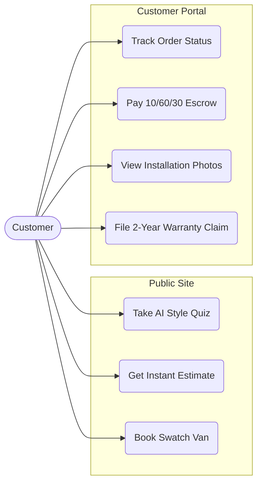
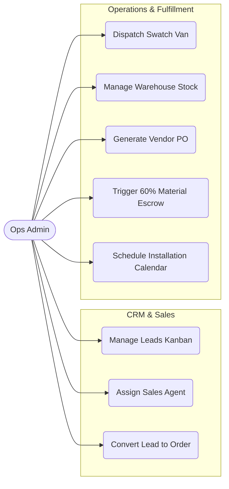
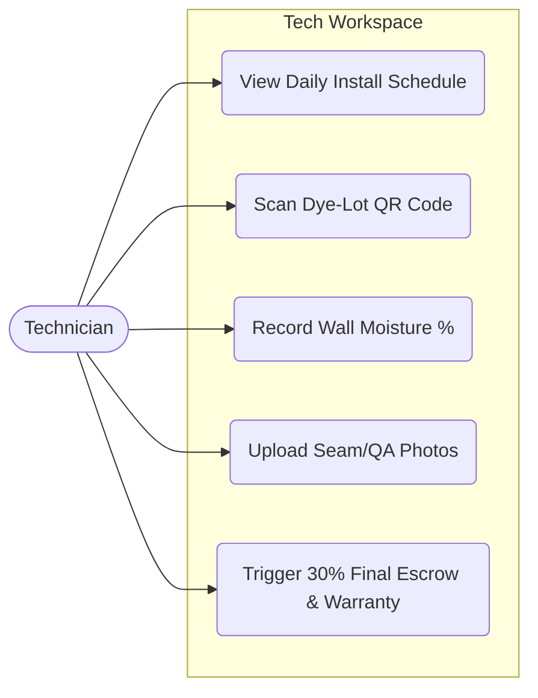
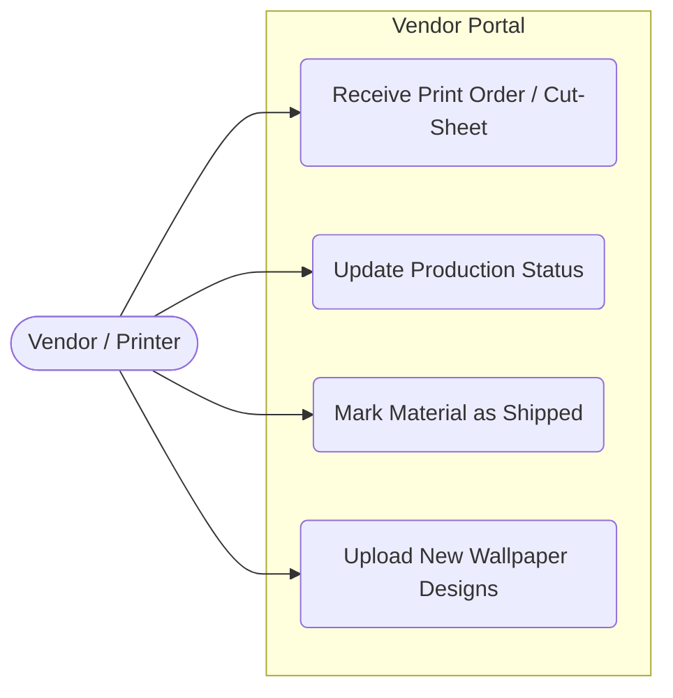

# AuroMakeover — UML Use Case Diagrams

This document outlines the core interactions between the platform's primary actors (Customer, Operations Admin, Technician, Vendor) and the system.

## 1. Customer Flow
The Customer interacts with the public-facing marketing site, the estimator, and the authenticated customer portal (`/my`).

## 2. Operations Admin Flow
The Ops Admin (or City Manager) uses the internal Ops Dashboard (`/ops`) to manage the entire business lifecycle.

## 3. Technician Flow
The Technician uses the mobile-optimized Tech Workspace (`/tech`) on-site at the customer's flat.

## 4. Vendor Flow
The Vendor uses the Vendor Portal (`/vendor`) to receive print orders and manage catalog items.

